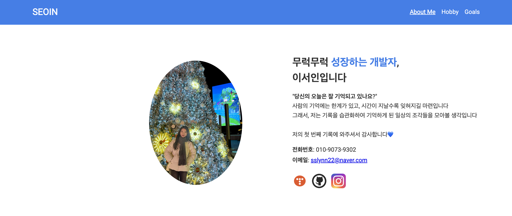
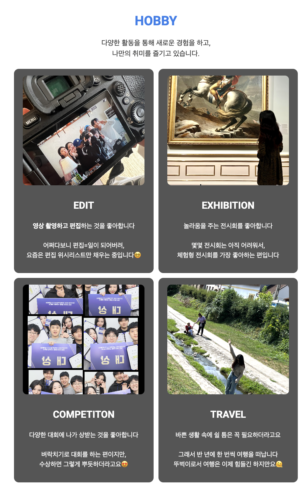
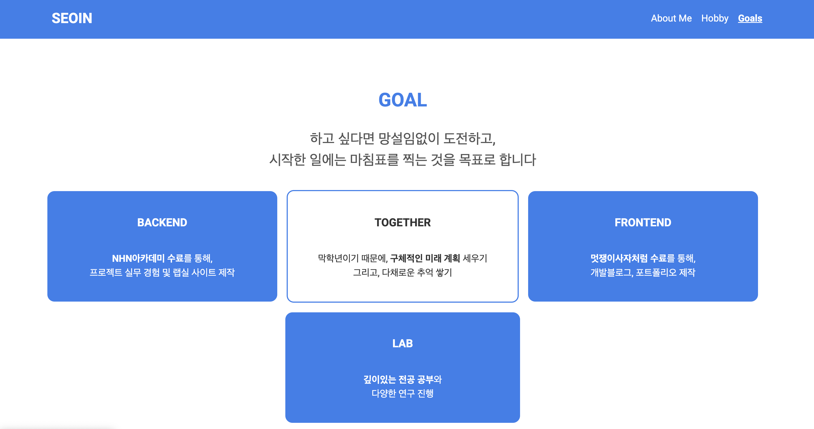

# **🦁 프론트엔드 2주차 과제 회고 📚**  

이번 주에는 **CSS를 활용하여 웹 페이지의 스타일을 적용하는 과제**를 진행했다.  
지난주 HTML을 사용하여 기본적인 구조를 만들었다면,  
이번 주는 **CSS를 통해 디자인을 적용하고 배치를 조정하는 과정**을 경험할 수 있었다.  

## 💡 기능 구현
### ✔︎ 메인 페이지
</img> 
**각 소셜 로고를 누르면, 나의 소셜 페이지로 이동하도록 기능을 구현하였다.**

포트폴리오를 만든다면 어떻게 만들면 좋을지, 생각하며 글을 써내려 갔다.

사실 나의 경력에 대한 부분도 작성하고 싶었으나, 급박하게 제작했던 터라 미래의 계획으로 넘겼다.

</img> 

글 간격이나 색감에 대해 아쉬움이 있다. 

아직 css를 자세하게 공부하지 않았기 때문에 깊이있는 공부 후 다시 포트폴리오 사이트를 제작해 봐야겠다🤔

</img> 
3 페이지 중에 가장 마음에 드는 레이아웃 구성이다.

확실히 백엔드와 다르게 내가 직접 디자인을 구현할 수 있는 것이 매력적이라고 느꼈다🤩

페이지를 구상하면서, 내 올해 목표에 대해 생각해보고 나 자신을 되돌아보는 시간이어서 뜻깊었다.

## **📌 배운 점**  
### 1️⃣ **CSS를 활용한 레이아웃 구성**  
HTML만으로는 단순한 페이지 구조만 만들 수 있었지만,  
CSS를 사용하면서 **레이아웃을 조정하고 디자인적인 요소를 추가하는 과정**이 흥미로웠다.  
특히 `display: flex;`와 `grid`를 활용하여 요소들을 배치하는 것이 중요하다는 것을 배웠다.  
처음에는 정렬이 생각한 대로 되지 않아 어려웠지만,  
`justify-content`와 `align-items`를 조정하면서 원하는 형태로 배치할 수 있었다.  

### 2️⃣ **간격과 여백 조정의 중요성**  
이번 과제를 하면서 **여백(margin, padding)이 디자인에 큰 영향을 미친다는 것**을 느꼈다.  
처음에는 요소 간 간격이 너무 넓거나 좁아서 어색했지만,  
적절한 `gap`, `margin`, `padding`을 조정하면서 더 균형 잡힌 디자인을 만들 수 있었다.  
특히 `box-sizing: border-box;`를 설정하는 것이 **레이아웃을 조정할 때 필수적이라는 점**을 깨달았다.  

### 3️⃣ **반응형 디자인에 대한 고민**  
이번 과제에서는 **나의 맥북 화면을 기준으로 작업했지만, 다른 모니터 사이즈, 모바일 화면에서는 어떻게 보일까?** 라는 고민이 들었다. 

아직 본격적으로 반응형 웹을 다루지는 않았지만,  
`max-width`, `min-width` 등의 속성을 활용하면  
화면 크기에 따라 유동적으로 조정할 수 있다는 점을 알게 되었다.  